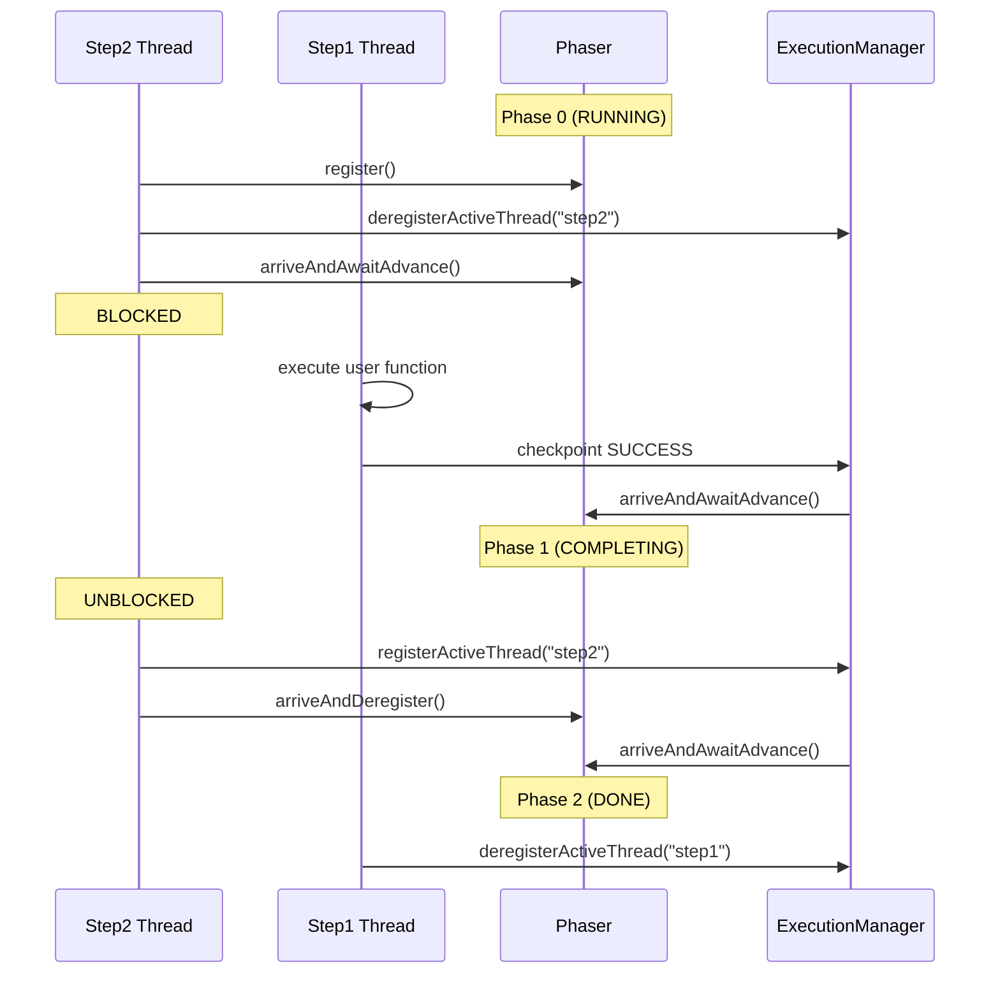

# ADR-002: Phaser-Based Operation Coordination

**Status:** Accepted  
**Date:** 2025-12-29


## Context

The SDK uses a unified suspension mechanism: when `activeThreads.isEmpty()`, execution suspends. This requires careful coordination between:
1. Background threads executing operations
2. Main thread calling `get()` and potentially blocking
3. Checkpoint system ensuring results are durable before completion

## Problem: Complex Blocking Scenarios

### Critical Case: Blocking on Retrying Operations
```java
var future1 = context.stepAsync("step1", () -> failsAndRetries());
var result = context.step("step2", () -> future1.get() + "-processed");
```

**What happens:**
1. step1-thread fails, deregisters (entering retry)
2. step2-thread calls `future1.get()`, must deregister (blocked waiting)
3. `activeThreads = {}` → suspension triggered correctly
4. Lambda re-invokes after retry delay
5. step1 succeeds → step2 must unblock safely

**Challenge:** How does step2-thread know when step1 completes? Simple signaling fails because completion must be **checkpoint-driven** (results durable before unblocking).

**Key insight:** Steps always reach phaser coordination because they have background threads keeping execution alive. Waits usually suspend immediately via `deregisterActiveThread()` before reaching phaser logic, only using phasers when other threads are active.

### Future Complex Operations
Operations like `runInChildContext` will create multiple child threads that may block on each other, requiring sophisticated multi-party coordination.

## Decision

Use Java `Phaser` for checkpoint-driven operation coordination.

### Implementation

```java
// Operation execution doesn't signal completion directly
T result = function.get();
executionManager.sendOperationUpdate(successUpdate); // Async checkpoint
// Phaser stays in Phase 0 (RUNNING)

// ExecutionManager advances phaser AFTER checkpoint succeeds
private void onCheckpointComplete(String newToken, List<Operation> ops) {
    if (isTerminalStatus(op.status())) {
        phaser.arriveAndAwaitAdvance(); // Phase 0→1: Unblock waiters
        phaser.arriveAndAwaitAdvance(); // Phase 1→2: Allow step deregistration
    }
}
```

**Usage patterns:**
- **Steps:** Always use phasers - `get()` blocks until ExecutionManager advances phaser after checkpoint
- **Waits:** Usually suspend before reaching phasers - only use them when other threads keep execution alive

### Two-Phase Completion Protocol

**Phase 0 (RUNNING):** Operation executing, waiters blocked
**Phase 1 (COMPLETING):** Waiters unblock and re-register as active  
**Phase 2 (DONE):** Step threads deregister safely

**Why two phases?** Prevents race condition:
```java
// Without two phases - RACE:
1. step2-thread deregisters, blocks on phaser
2. step1 completes, checkpoints
3. step1-thread deregisters → suspension triggered  
4. step2-thread tries to re-register → TOO LATE

// With two phases - SAFE:
1. step2-thread deregisters, blocks on Phase 0
2. step1 completes, checkpoints
3. ExecutionManager advances Phase 0→1 → step2-thread unblocks and re-registers
4. ExecutionManager advances Phase 1→2 → step1-thread deregisters safely
```

#### Sequence Diagram


## Alternatives Considered

### Simple Thread Signaling
**Rejected:** Fails on blocking scenarios. If thread A blocks on thread B's result while B is retrying, A remains registered but inactive, preventing suspension.

### CompletableFuture
**Rejected:** 
- Checkpoint timing issues (complete before/after checkpoint)
- Single-completion model doesn't handle retry attempts
- No integration with thread lifecycle management

## Consequences

**Enables:**
- Correct suspension on blocking scenarios
- Checkpoint-driven completion ensuring durability
- Support for future complex operations requiring multi-party coordination
- Unified `get()` logic for both new and replayed operations

**Cost:**
- Phaser complexity vs simpler alternatives
- Two-phase protocol cognitive overhead

The phaser approach is architected to support the full spectrum of durable operations, ensuring the SDK can handle complex coordination patterns without architectural changes.
