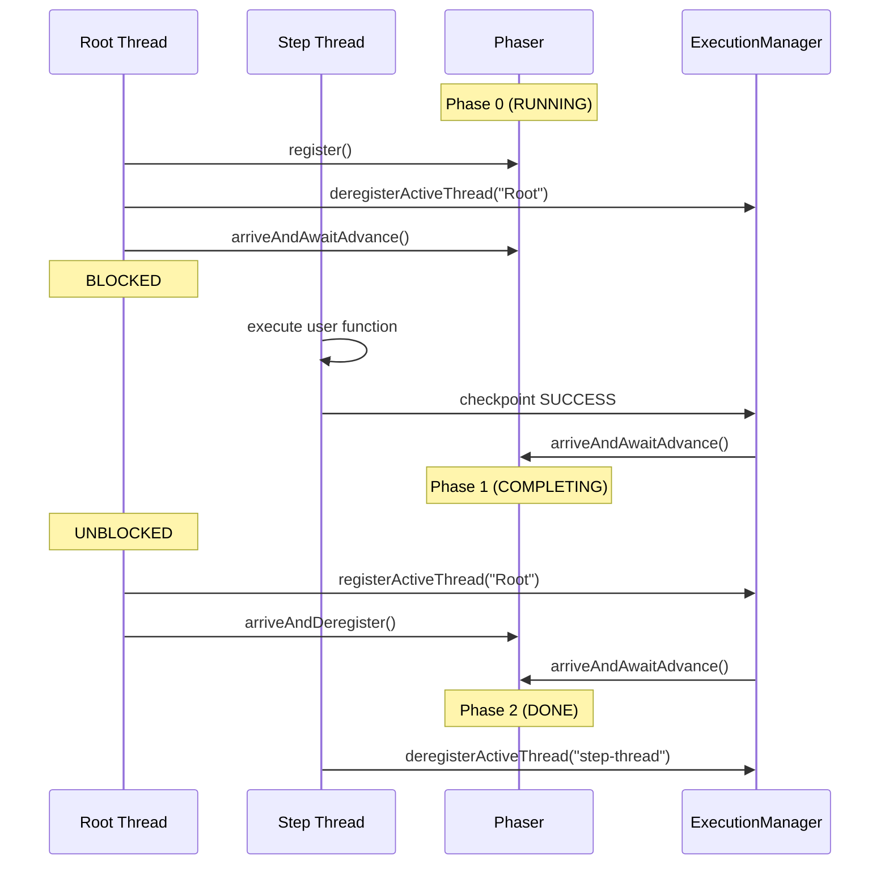
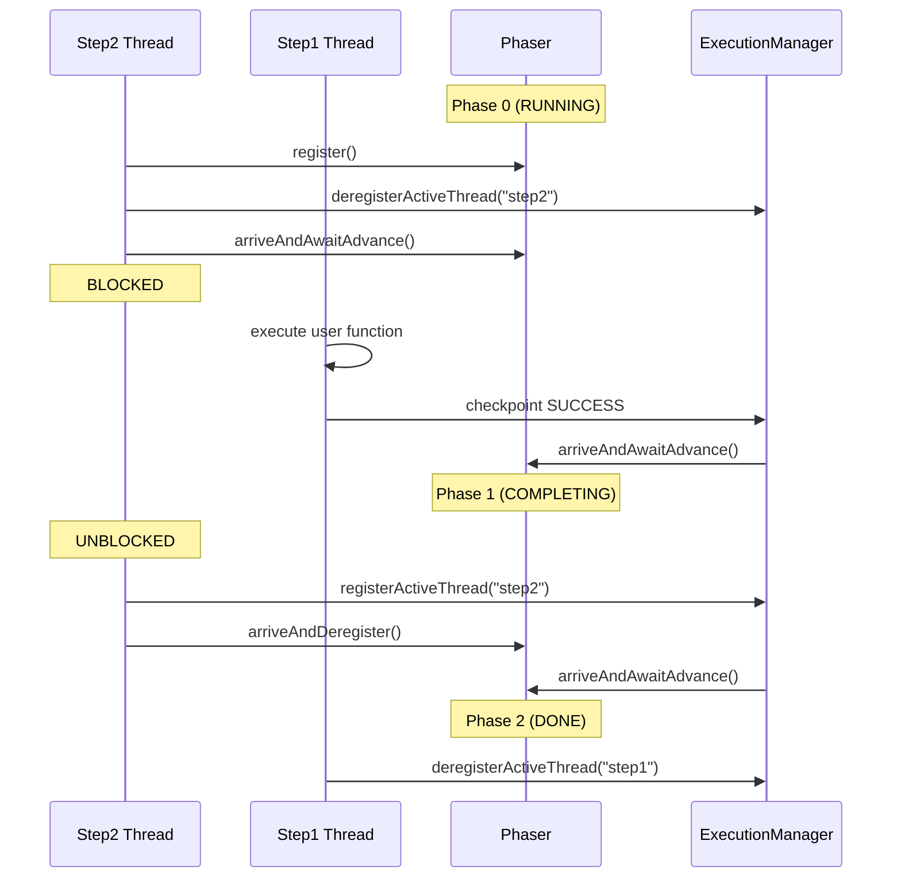

# ADR-002: Phaser-Based Operation Coordination

**Status:** Superseded by ADR-003 CompletableFuture-Based Operation Coordination
**Date:** 2025-12-29


## Context

The SDK uses a unified suspension mechanism: when `activeThreads.isEmpty()`, execution suspends. Thread counting handles simple cases, but complex scenarios require sophisticated coordination.

### Simple Case: Direct Suspension
```java
context.wait(Duration.ofMinutes(5)); // Root deregisters → immediate suspension
```

### Complex Case: Blocking on Retrying Operations
```java
var future1 = context.stepAsync("step1", () -> failsAndRetries());
var result = context.step("step2", () -> future1.get() + "-processed");
```

**Problem:** Simple thread counting fails because step2's thread would stay registered while blocked on `future1.get()`, preventing suspension during step1's retry delay.

**Required coordination:** When step1 retries, step2's thread must:
1. Deregister (to allow suspension during retry delay)
2. Block until step1 completes or suspends for another retry
3. Re-register when step1 finishes or when resuming from suspension
4. Ensure step1's result is checkpointed before proceeding

**Additional scenarios requiring coordination:**
- Nested blocking: Multiple threads blocking on each other's results
- Future operations: `runInChildContext` with multiple child threads
- Race conditions: Ensuring checkpoint completion before thread lifecycle changes

## Decision

Use Java `Phaser` for checkpoint-driven operation coordination.
### Implementation

```java
// Operation execution doesn't signal completion directly
T result = function.get();
executionManager.sendOperationUpdate(successUpdate); // Async checkpoint
// Phaser stays in Phase 0 (RUNNING)

// ExecutionManager advances phaser AFTER checkpoint succeeds
private void onCheckpointComplete(String newToken, List<Operation> ops) {
    if (isTerminalStatus(op.status())) {
        phaser.arriveAndAwaitAdvance(); // Phase 0→1: Unblock waiters
        phaser.arriveAndAwaitAdvance(); // Phase 1→2: Allow step deregistration
    }
}
```

**Usage patterns:**
- **Steps:** Always use phasers - `get()` blocks until ExecutionManager advances phaser after checkpoint
- **Waits:** Usually suspend before reaching phasers - only use them when other threads keep execution alive

### Two-Phase Completion Protocol

- **Phase 0 (RUNNING):** Operation executing, waiters blocked 
- **Phase 1 (COMPLETING):** Waiters unblock and re-register as active
- **Phase 2 (DONE):** Step threads deregister safely

#### Single Step Coordination


**Why two phases?** Prevents race condition:
```java
// Without two phases - RACE:
1. Root thread deregisters, blocks on phaser
2. Step completes, checkpoints
3. Step thread deregisters → suspension triggered  
4. Root thread tries to re-register → TOO LATE

// With two phases - SAFE:
1. Root thread deregisters, blocks on Phase 0
2. Step completes, checkpoints
3. ExecutionManager advances Phase 0→1 → Root thread unblocks and re-registers
4. ExecutionManager advances Phase 1→2 → Step thread deregisters safely
```

#### Complex Blocking Scenario

### Phaser Creation and Lifecycle
```java
// ExecutionManager.startPhaser() - creates phaser for each operation
var phaser = new Phaser(1);
openPhasers.put(operationId, phaser);
```

Each durable operation (step, wait) gets its own phaser to coordinate completion.

### When Phasers Are Actually Used

**Steps:** Always use phasers for coordination
```java
// StepOperation.get() - blocks waiting for advancement
phaser.arriveAndAwaitAdvance(); // Blocks until ExecutionManager advances it

// ExecutionManager.onCheckpointComplete() - advances after checkpoint succeeds
phaser.arriveAndAwaitAdvance(); // Phase 0→1: Unblock waiters
phaser.arriveAndAwaitAdvance(); // Phase 1→2: Allow step deregistration
```

**Waits:** Usually suspend before reaching phaser logic
```java
// WaitOperation.get() - normal case
executionManager.deregisterActiveThread("Root"); // ← Suspension happens here
// SuspendExecutionException thrown - phaser code never reached

// Only when other threads active:
phaser.arriveAndAwaitAdvance(); // Phase 0→1 (immediate advancement)
```

**Key difference:** Steps have background threads keeping execution alive, so they reach phaser coordination. Waits have no background threads, so they usually suspend immediately when root thread deregisters.

**Advanced cases:** When other threads keep execution alive, both waits and step retries use in-process polling to detect backend completion and advance phasers accordingly.


## Alternatives Considered

### Simple Thread Signaling
**Rejected:** Fails on blocking scenarios. If thread A blocks on thread B's result while B is retrying, A remains registered but inactive, preventing suspension.

### CompletableFuture
**Rejected:** 
- Checkpoint timing issues (complete before/after checkpoint)
- Single-completion model doesn't handle retry attempts
- No integration with thread lifecycle management

## Consequences

**Enables:**
- Correct suspension on blocking scenarios
- Checkpoint-driven completion ensuring durability
- Support for future complex operations requiring multi-party coordination
- Unified `get()` logic for both new and replayed operations

**Cost:**
- Phaser complexity vs simpler alternatives
- Two-phase protocol cognitive overhead

The phaser approach is architected to support the full spectrum of durable operations, ensuring the SDK can handle complex coordination patterns without architectural changes.
