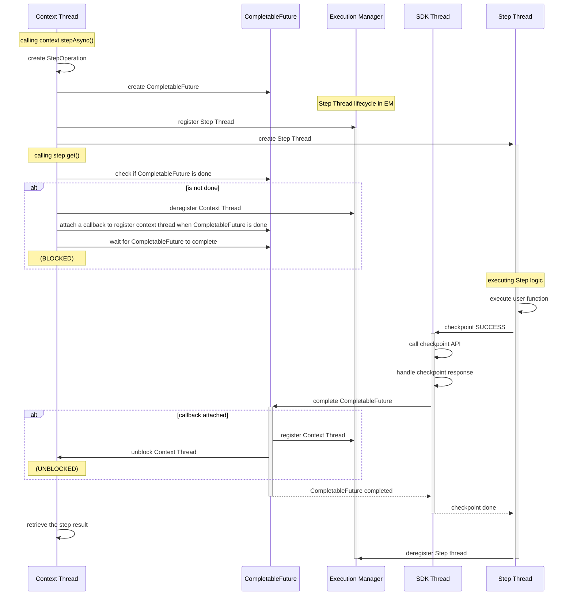
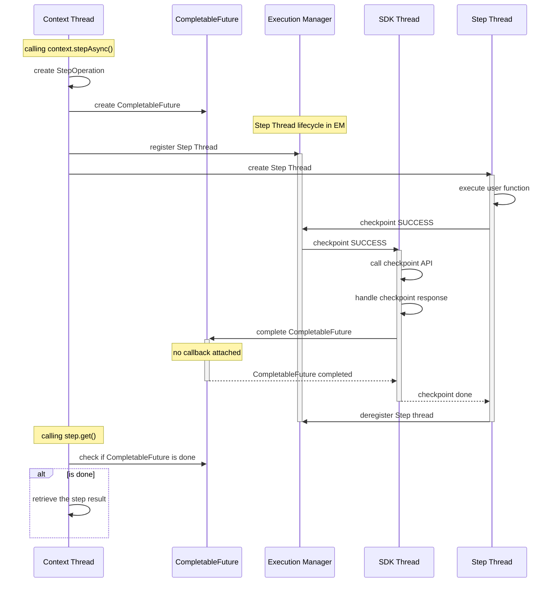

# ADR-003: CompletableFuture-Based Operation Coordination

**Status:** Review
**Date:** 2026-02-18

## Context

Currently, the SDK employs a Phaser-based mechanism for coordinating operations. The design is detailed in [ADR-002: Phaser-Based Operation Coordination](002-phaser-based-coordination.md).

With this design, we can:
 
- Register a thread when it begins and deregister it when it completes;
- Block `DurableFuture::get()` calls until the operation completes;
- Suspend execution when no registered thread exists.

However, this design has a few issues:

- We allow the Phasers to advance over predefined phase ranges (0 - RUNNING, 1 - COMPLETE). If we received duplicate completion updates from local runner or backend API, the phase could be advanced to 2, 3, and so on.
- We assume that there is only one party during operation replay, and two parties when receiving an operation state from checkpoint API. We call Phaser `arriveAndAwaitAdvance` once or twice based on this assumption, but it could be incorrect. In complex scenarios, this could lead to a deadlock (not enough arrive calls) or exceeding the phase range (too many arrive calls).
- The Phaser has higher complexity and cognitive overhead compared to other synchronization mechanisms.

## Decision

We will implement operation coordination using `CompletableFuture`.,

### Threads

Each piece of user code (e.g. the main Lambda function body, a step body, a child context body) runs in its own user thread from the user thread pool. 
Execution manager tracks active running user threads. 
When a new step or a new child context is created, a new thread is created and registered in execution manager. 
When the step or the child context completes, the corresponding thread is deregistered from execution manager.
When the user code is blocked on `DurableFuture::get()` or another synchronous durable operation (e.g., `wait()`), the caller thread is deregistered from execution manager. 
When there is no registered thread in execution manager, the durable execution is suspended.

A special SDK thread is created and managed by the SDK to make checkpoint API requests.

### CompletableFuture

The `CompletableFuture` is used to manage the completion of operations. It allows us to track the progress of operations and handle their completion in a more flexible and readable manner.

Each durable operation has a `CompletableFuture` field.
This field is used by user threads and the SDK thread communicate the completion of operations. 

For example, when a context executes a step, the communication occurs as follows

|   | Context Thread                                                                                              | Step Thread                                                         | SDK Thread                                                                                                                                                                    |
|---|-------------------------------------------------------------------------------------------------------------|---------------------------------------------------------------------|-------------------------------------------------------------------------------------------------------------------------------------------------------------------------------|
| 1 | create StepOperation (a CompletableFuture is created)                                                       | (not created)                                                       | (idle)                                                                                                                                                                        |
| 2 | checkpoint START event (synchronously or asynchronously)                                                    | (not created)                                                       | call checkpoint API                                                                                                                                                           |
| 3 | create and register the Step thread                                                                         | execute user code for the step                                      | (idle)                                                                                                                                                                        |
| 4 | call `DurableFuture::get()`, deregister the context thread and wait for the `CompletableFuture` to complete | (continue)                                                          | (idle)                                                                                                                                                                        |
| 5 | (blocked)                                                                                                   | checkpoint the step result and wait for checkpoint call to complete | call checkpoint API, and handle the API response. If it is a terminal response, complete the step operation CompletableFuture, register and unblock the context thread.       |
| 6 | retrieve the result of the step                                                                             | deregister and terminate the Step thread                            | (idle)                                                                                                                                                                        |        

If the step code completes quickly, an alternative scenario could happen as follows

|   | Context Thread                                                                              | Step Thread                                                         | SDK Thread                                                                                                                     |
|---|---------------------------------------------------------------------------------------------|---------------------------------------------------------------------|--------------------------------------------------------------------------------------------------------------------------------|
| 1 | create StepOperation (a CompletableFuture is created)                                       | (not created)                                                       | (idle)                                                                                                                         |
| 2 | checkpoint START event (synchronously or asynchronously)                                    | (not created)                                                       | call checkpoint API                                                                                                            |
| 3 | create and register the Step thread                                                         | execute user code for the step and complete quickly                 | (idle)                                                                                                                         |
| 5 | (do something else or just get starved)                                                     | checkpoint the step result and wait for checkpoint call to complete | call checkpoint API, and handle the API response. If it is a terminal response, complete the Step operation CompletableFuture. |
| 4 | call `DurableFuture::get()` (non-blocking because `CompletableFuture` is already completed) | deregister and terminate the Step thread                            | (idle)                                                                                                                         |
| 6 | retrieve the result of the step                                                             | (ended)                                                             | (idle)                                                                                                                         |        

The following two key mechanisms make `CompletableFuture` based solution work properly.

- Strict ordering of `register and unblock the context thread` and `deregister and terminate the Step thread`.
  - When a step completes, it calls checkpoint API to checkpoint the result and wait for the checkpoint call to complete.
  - SDK thread receives the checkpoint request, makes the API call, and processes the API response.
    - If the response contains a terminal operation state (it should for a succeeded or failed step), it will send the response to the `StepOperation` to complete `CompletableFuture`. When completing the future, the attached completion stages will be executed synchronously, which will register any context threads that are waiting for the result of the step.
  - When SDK thread completes the API request and registers all waiting threads, the step thread continues to deregister itself from execution manager.
- Synchronized access to `CompletableFuture`.
  - When a context thread calls `DurableFuture::get()`, it checks if `CompletableFuture` is done. 
    1. If the future is done, `get()` will return the operation result. Otherwise, the context thread will
    2. deregister itself from execution manager;
    3. attach a completion stage to `CompletableFuture` that will re-register the context thread when later the future is completed;
    4. wait for `CompletableFuture` to complete.
  - Meantime, `CompletableFuture` can be completed by SDK thread when handling the checkpoint API responses. 
    - A race condition will occur if this happens when the context thread is between the step `a` and `c`.
    - To prevent the race condition, all the mutating access to `CompletableFuture` either to complete the future or to attach a completion stage is synchronized.

## Consequences

Enables:
- Support for complex scenarios which were not supported by Phaser
- Reduced implementation complexity and improved readability
- `CompletableFuture` based implementation of `DurableFuture::allOf` and `DurableFuture::anyOf`

Cost:
- Synchronized access to `CompletableFuture`
- Obscured ordering of thread registration/deregistration