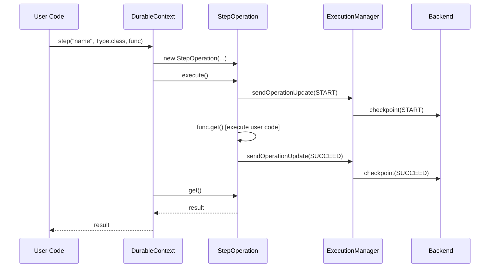
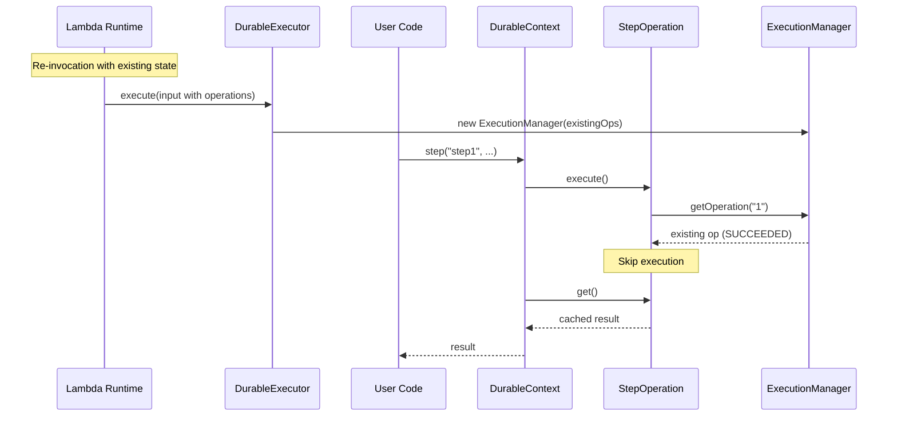
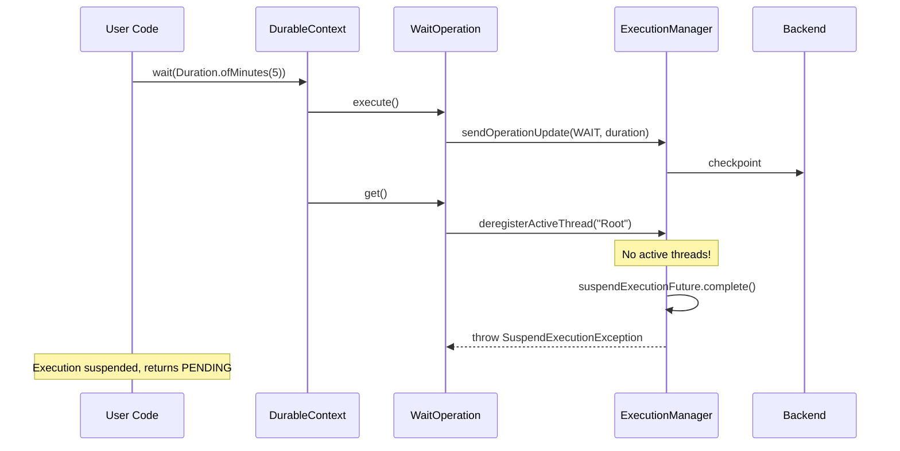

# AWS Lambda Durable Execution Java SDK - Internal Design

> **Note:** This document is for SDK developers and contributors. For user-facing documentation, see the [README](../README.md).

## Overview

This document explains the internal architecture, threading model, and extension points to help contributors understand how the SDK works under the hood. Core design decisions and advanced concepts are further outlined in the [Architecture Decision Records](adr/).

## Module Structure

```
aws-durable-execution-sdk-java/
├── sdk/                      # Core SDK - DurableHandler, DurableContext, operations
├── sdk-testing/              # Test utilities for local and cloud testing
├── sdk-integration-tests/    # Integration tests using LocalDurableTestRunner
└── examples/                 # Real-world usage patterns as customers would implement them
```

| Module | Purpose | Key Classes |
|--------|---------|-------------|
| `sdk` | Core runtime - extend `DurableHandler`, use `DurableContext` for durable operations | `DurableHandler`, `DurableContext`, `DurableExecutor`, `ExecutionManager` |
| `sdk-testing` | Test utilities: `LocalDurableTestRunner` (in-memory, simulates re-invocations and time-skipping) and `CloudDurableTestRunner` (executes against deployed Lambda) | `LocalDurableTestRunner`, `CloudDurableTestRunner`, `LocalMemoryExecutionClient`, `TestResult` |
| `sdk-integration-tests` | Dogfooding tests - validates the SDK using its own test utilities. Separate module keeps dependencies acyclic: `sdk` → `sdk-testing` → `sdk-integration-tests`. | Test classes only |
| `examples` | Real-world usage patterns as customers would implement them, with local and cloud tests | Example handlers, `CloudBasedIntegrationTest` |

---

## API Surface

### User-Facing (DurableContext)

```java
// Synchronous step
T step(String name, Class<T> type, Supplier<T> func)
T step(String name, Class<T> type, Supplier<T> func, StepConfig config)
T step(String name, TypeToken<T> type, Supplier<T> func)

// Asynchronous step
DurableFuture<T> stepAsync(String name, Class<T> type, Supplier<T> func)
DurableFuture<T> stepAsync(String name, Class<T> type, Supplier<T> func, StepConfig config)

// Wait
void wait(Duration duration)
void wait(String name, Duration duration)

// Lambda context access
Context getLambdaContext()
```

### DurableFuture

```java
T get()  // Blocks until complete, may suspend
```

### Handler Configuration

```java
public class MyHandler extends DurableHandler<Input, Output> {
    @Override
    protected DurableConfig createConfiguration() {
        return DurableConfig.builder()
            .withLambdaClient(customLambdaClient)
            .withSerDes(new CustomSerDes())
            .withExecutorService(Executors.newFixedThreadPool(4))
            .build();
    }
}
```

| Option | Default |
|--------|---------|
| `lambdaClient` | Auto-created `LambdaClient` for current region, primed for performance (see [`DurableConfig.java`](../sdk/src/main/java/com/amazonaws/lambda/durable/DurableConfig.java)) |
| `serDes` | `JacksonSerDes` |
| `executor` | `Executors.newCachedThreadPool()` |
| `loggerConfig` | `LoggerConfig.defaults()` (suppress replay logs) |

### Step Configuration

```java
context.step("name", Type.class, supplier,
    StepConfig.builder()
        .serDes(stepSpecificSerDes)
        .retryStrategy(RetryStrategies.exponentialBackoff(3, Duration.ofSeconds(1)))
        .semantics(AT_MOST_ONCE_PER_RETRY)
        .build());
```

---

## Architecture

```
┌─────────────────────────────────────────────────────────────────────────┐
│                           Lambda Runtime                                │
└─────────────────────────────────────────────────────────────────────────┘
                                    │
                                    ▼
┌─────────────────────────────────────────────────────────────────────────┐
│  DurableHandler<I,O>                                                    │
│  - Entry point (RequestStreamHandler)                                   │
│  - Extracts input type via reflection                                   │
│  - Delegates to DurableExecutor                                         │
└─────────────────────────────────────────────────────────────────────────┘
                                    │
                                    ▼
┌─────────────────────────────────────────────────────────────────────────┐
│  DurableExecutor                                                        │
│  - Creates ExecutionManager, DurableContext                             │
│  - Runs handler in executor                                             │
│  - Waits for completion OR suspension                                   │
│  - Returns SUCCESS/PENDING/FAILED                                       │
└─────────────────────────────────────────────────────────────────────────┘
                                    │
                    ┌───────────────┴───────────────┐
                    ▼                               ▼
┌──────────────────────────────┐    ┌──────────────────────────────┐
│  DurableContext              │    │  ExecutionManager            │
│  - User-facing API           │    │  - State (ops, token)        │
│  - step(), stepAsync()       │    │  - Thread coordination       │
│  - wait()                    │    │  - Phaser management         │
│  - Operation ID counter      │    │  - Checkpoint batching       │
└──────────────────────────────┘    │  - Polling                   │
            │                       └──────────────────────────────┘
            │                                       │
            ▼                                       ▼
┌──────────────────────────────┐    ┌──────────────────────────────┐
│  Operations                  │    │  CheckpointBatcher           │
│  - StepOperation<T>          │    │  - Queues requests           │
│  - WaitOperation             │    │  - Batches API calls (750KB) │
│  - execute() / get()         │    │  - Notifies via callback     │
└──────────────────────────────┘    └──────────────────────────────┘
                                                    │
                                                    ▼
                                    ┌──────────────────────────────┐
                                    │  DurableExecutionClient      │
                                    │  - checkpoint()              │
                                    │  - getExecutionState()       │
                                    └──────────────────────────────┘
```

### Package Structure

```
com.amazonaws.lambda.durable
├── DurableHandler<I,O>      # Entry point
├── DurableExecutor          # Lifecycle orchestration
├── DurableContext           # User API
├── DurableFuture<T>         # Async handle
├── StepConfig               # Step configuration
├── TypeToken<T>             # Generic type capture
│
├── execution/
│   ├── ExecutionManager     # Central coordinator
│   ├── ExecutionMode        # REPLAY or EXECUTION state
│   ├── CheckpointBatcher    # Batching (package-private)
│   ├── CheckpointCallback   # Callback interface
│   ├── SuspendExecutionException
│   ├── ThreadType           # CONTEXT, STEP
│   └── ExecutionPhase       # RUNNING(0), COMPLETING(1), DONE(2)
│
├── operation/
│   ├── DurableOperation<T>  # Interface
│   ├── StepOperation<T>     # Step logic
│   └── WaitOperation        # Wait logic
│
├── logging/
│   ├── DurableLogger        # Context-aware logger wrapper (MDC-based)
│   └── LoggerConfig         # Replay suppression config
│
├── retry/
│   ├── RetryStrategy        # Interface
│   ├── RetryStrategies      # Presets
│   ├── RetryDecision        # shouldRetry + delay
│   └── JitterStrategy       # Jitter options
│
├── client/
│   ├── DurableExecutionClient        # Interface
│   └── LambdaDurableFunctionsClient  # AWS SDK impl
│
├── model/
│   ├── DurableExecutionInput   # Lambda input
│   ├── DurableExecutionOutput  # Lambda output
│   └── ExecutionStatus         # SUCCEEDED/PENDING/FAILED
│
├── serde/
│   ├── SerDes              # Interface
│   ├── JacksonSerDes       # Jackson impl
│   └── AwsSdkV2Module      # SDK type support
│
└── exception/
    ├── DurableExecutionException
    ├── NonDeterministicExecutionException
    ├── StepFailedException
    ├── StepInterruptedException
    └── SerDesException
```

---

## Sequence Diagrams

### Normal Step Execution



### Replay Scenario



### Wait with Suspension



---

## Exception Hierarchy

```
DurableExecutionException (base)
├── StepFailedException          # Step failed after all retries
├── StepInterruptedException     # Step interrupted (AT_MOST_ONCE)
├── NonDeterministicExecutionException  # Replay mismatch
└── SerDesException              # Serialization error

SuspendExecutionException        # Internal: triggers suspension (not user-facing)
```

| Exception | Trigger | Recovery |
|-----------|---------|----------|
| `StepFailedException` | Step throws after exhausting retries | Catch in handler or let fail |
| `StepInterruptedException` | AT_MOST_ONCE step interrupted mid-execution | Treat as failure |
| `NonDeterministicExecutionException` | Replay finds different operation than expected | Bug in handler (non-deterministic code) |
| `SerDesException` | Jackson fails to serialize/deserialize | Fix data model or custom SerDes |

---

## Logging Internals

### Replay Mode Tracking

`ExecutionManager` tracks whether we're replaying completed operations or executing new ones via `ExecutionMode`:

- **REPLAY**: Starts in this mode if `operations.size() > 1` (has checkpointed operations beyond the initial EXECUTION op)
- **EXECUTION**: Transitions when `getOperationAndUpdateReplayState()` encounters:
  - An operation ID not in the checkpoint log (new operation)
  - An operation that is NOT in a terminal state (needs to continue executing)

Terminal states (SUCCEEDED, FAILED, CANCELLED, TIMED_OUT, STOPPED) stay in REPLAY mode since we're just returning cached results.

This is a one-way transition (REPLAY → EXECUTION, never back). `DurableLogger` checks `isReplaying()` to suppress duplicate logs during replay.

### MDC-Based Context Enrichment

`DurableLogger` uses SLF4J's MDC (Mapped Diagnostic Context) to enrich log entries with execution metadata. MDC is thread-local by design, so context is set once per thread rather than per log call for performance.

**MDC Keys:**
| Key | Set When | Description |
|-----|----------|-------------|
| `durableExecutionArn` | Logger construction | Execution ARN |
| `requestId` | Logger construction | Lambda request ID |
| `operationId` | Step start | Current operation ID |
| `operationName` | Step start | Step name |
| `attempt` | Step start | Retry attempt number |

**Context Flow:**
1. `DurableLogger` constructor sets execution-level MDC (ARN, requestId) on the handler thread
2. `StepOperation.executeStepLogic()` calls `durableLogger.setOperationContext()` before user code runs
3. User code logs via `context.getLogger()` - MDC values automatically included
4. `clearOperationContext()` called in finally block after step completes

**Log Pattern Example (Log4j2):**
```xml
<PatternLayout pattern="%d %-5level %logger - %msg%notEmpty{ | arn=%X{durableExecutionArn}}%notEmpty{ id=%X{operationId}}%notEmpty{ op=%X{operationName}}%notEmpty{ attempt=%X{attempt}}%n"/>
```

**Output:**
```
12:34:56 INFO  c.a.l.d.DurableContext - Processing order | arn=arn:aws:lambda:us-east-1:123:function:test
12:34:56 DEBUG c.a.l.d.DurableContext - Validating items | arn=arn:aws:lambda:us-east-1:123:function:test id=1 op=validate attempt=0
```

---

## Backend Integration

### Large Response Handling

If result > 6MB Lambda limit:
1. Checkpoint result to backend
2. Return empty response
3. Backend stores and returns result

### Checkpoint Batching

Multiple concurrent operations may checkpoint simultaneously. `CheckpointBatcher` batches these into single API calls to reduce latency and stay within the 750KB request limit.

Currently uses micro-batching: batches only what accumulates during the polling thread scheduling overhead. Early tests suggest this window may be too short for effective batching—an artificial delay might need to be introduced.

```
StepOperation 1 ──┐
                  │
StepOperation 2 ──┼──► CheckpointBatcher ──► Backend
                  │
WaitOperation ────┘
```

Callback mechanism avoids cyclic dependency between `ExecutionManager` and `CheckpointBatcher`:

```java
interface CheckpointCallback {
    void onComplete(String newToken, List<Operation> operations);
}
```

---

## Testing Infrastructure

### LocalDurableTestRunner

In-memory test runner that simulates the full execution lifecycle without AWS.

```java
// Default: auto-skip time
runner.runUntilComplete(input);  // Instantly completes waits

// Manual control
runner.withSkipTime(false);
runner.run(input);               // Returns PENDING at wait
runner.advanceTime();            // Move past wait
runner.run(input);               // Continues from wait
```

### Failure Simulation

```java
// Simulate checkpoint loss (fire-and-forget START lost)
runner.simulateFireAndForgetCheckpointLoss("step-name");

// Reset step to STARTED (simulate crash after START checkpoint)
runner.resetCheckpointToStarted("step-name");
```

### CloudDurableTestRunner

Tests against deployed Lambda:

```java
var runner = CloudDurableTestRunner.create(arn, Input.class, Output.class)
    .withPollInterval(Duration.ofSeconds(2))
    .withTimeout(Duration.ofMinutes(5));

TestResult<Output> result = runner.run(input);
```

### Extension Points for Testing

**DurableExecutionClient Interface** - Backend abstraction for testing or alternative implementations:

```java
public interface DurableExecutionClient {
    CheckpointDurableExecutionResponse checkpoint(
        String arn, String token, List<OperationUpdate> updates);
    
    GetDurableExecutionStateResponse getExecutionState(String arn, String marker);
}
```

Implementations:
- `LambdaDurableFunctionsClient` - Production (wraps AWS SDK)
- `LocalMemoryExecutionClient` - Testing (in-memory)

For production customization, use `DurableConfig.builder().withLambdaClient(lambdaClient)`.
For testing, use `DurableConfig.builder().withDurableExecutionClient(localMemoryClient)`.

---

## Custom SerDes and TypeToken

**Custom SerDes Interface:**
```java
public interface SerDes {
    String serialize(Object value);
    <T> T deserialize(String data, Class<T> type);
    <T> T deserialize(String data, TypeToken<T> typeToken);
}
```

**TypeToken and Type Erasure:**

Java's type erasure removes generic type parameters at runtime (`List<User>` becomes `List`). This is problematic for deserialization—Jackson needs the full type to reconstruct objects correctly.

`TypeToken<T>` solves this by capturing generic types at compile time. Creating `new TypeToken<List<User>>() {}` produces an anonymous subclass whose superclass type parameter is preserved in bytecode and accessible via reflection (`getGenericSuperclass()`).

The `SerDes` interface provides both `Class<T>` and `TypeToken<T>` overloads:
- Use `Class<T>` for simple types: `String.class`, `User.class`
- Use `TypeToken<T>` for parameterized types: `new TypeToken<List<User>>() {}`

---

## Thread Coordination and Suspension Mechanism (Advanced)

The SDK uses a threaded execution model where the handler runs in a background thread, racing against a suspension future. This enables immediate suspension when operations need to pause execution (waits, retries), without waiting for the handler to complete naturally.

### Complete Suspension Flow

#### 1. Handler Level - The Suspension Race
Handler runs in background thread, racing against suspension detection:
```java
// DurableExecutor - which completes first?
CompletableFuture.anyOf(suspendFuture, handlerFuture).get();
```
Returns `PENDING` if suspension wins, `SUCCESS` if handler completes. See [ADR-001: Threaded Handler Execution](adr/001-threaded-handler-execution.md).

#### 2. Suspension Detection - Unified Thread Counting
We use thread counting as the suspension trigger because threads naturally deregister when they cannot make progress on durable operations. This provides a simple, unified mechanism that works across all operation types.

```java
// ExecutionManager.deregisterActiveThread() - ONLY suspension trigger
synchronized (this) {
    activeThreads.remove(threadId);
    if (activeThreads.isEmpty()) {
        suspendExecutionFuture.complete(null); // Suspension wins the race
        throw new SuspendExecutionException();
    }
}
```

**Suspension triggers when:** There are no active threads (all have deregistered). The SDK tracks two types of threads:

| Thread Type | Purpose | Deregisters When |
|-------------|---------|------------------|
| **Root thread** | Main execution thread running the handler function | • Calling `future.get()` to allow suspension while blocked<br>• Calling `context.wait()` to trigger immediate suspension |
| **Step threads** | Background threads executing individual step operations | • Completing work: After checkpointing result (success or failure) |

**Why root thread deregistration matters:** Critical for allowing suspension when steps are retrying or when multiple operations depend on each other.
This approach ensures suspension happens precisely when no thread can make progress on durable operations.

#### Advanced Feature: In-Process Completion
In scenarios where waits or step retries would normally suspend execution, but other active threads prevent suspension, the SDK automatically switches to in-process completion by polling the backend until timing conditions are met. This allows complex concurrent workflows to complete efficiently without unnecessary Lambda re-invocations or extended waiting periods.

### From Thread Tracking to Phaser Coordination

Thread counting handles simple cases, but complex scenarios require sophisticated coordination:

**Simple case - Wait operations:**
```java
context.wait(Duration.ofMinutes(5)); // Root deregisters → immediate suspension
```

**Complex case - Blocking on retrying operations:**
```java
var future1 = context.stepAsync("step1", () -> failsAndRetries());
var result = context.step("step2", () -> future1.get() + "-processed");
```

**Without phasers:** Simple thread counting fails because step2's thread would stay registered while blocked on `future1.get()`, preventing `activeThreads.isEmpty()` from triggering suspension → Lambda stays active during step1's retry delay instead of suspending.

**What should happen instead:** step2's root thread must deregister when blocked, allow suspension during step1's retry, then coordinate re-registration when step1 completes with checkpointed results.

**The problem:** When step1 retries, step2's root thread must:
1. Deregister (to allow suspension during retry delay)
2. Block until step1 either completes successfully or wants to suspend for another retry
3. Re-register when step1 finishes or when resuming from suspension
4. Ensure step1's result is checkpointed before proceeding

**Additional complex scenarios:**
- **Nested blocking:** Multiple threads blocking on each other's results
- **Future operations:** `runInChildContext` with multiple child threads coordinating
- **Race conditions:** Ensuring checkpoint completion before thread lifecycle changes

These scenarios are why we chose **phasers** - a multi-party synchronization primitive that coordinates checkpoint-driven completion.

See [ADR-002: Phaser-Based Operation Coordination](adr/002-phaser-based-coordination.md) for detailed implementation and usage patterns.
