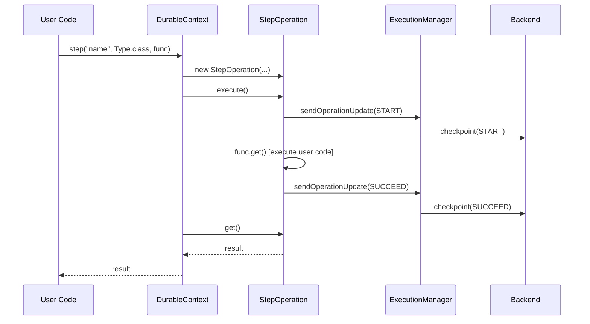
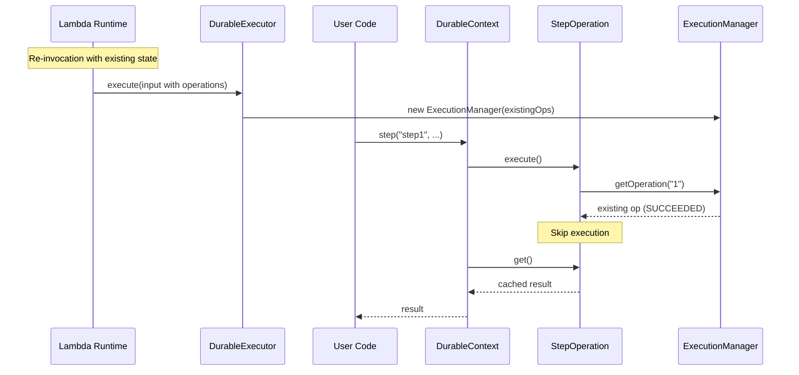
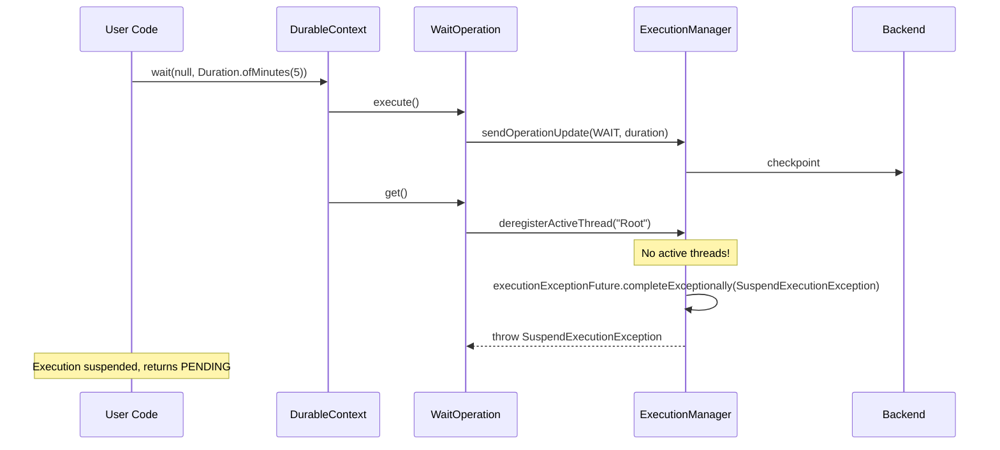

# AWS Lambda Durable Execution Java SDK - Internal Design

> **Note:** This document is for SDK developers and contributors. For user-facing documentation, see the [README](../README.md).

## Overview

This document explains the internal architecture, threading model, and extension points to help contributors understand how the SDK works under the hood. Core design decisions and advanced concepts are further outlined in the [Architecture Decision Records](adr/).

## Module Structure

```
aws-durable-execution-sdk-java/
├── sdk/                      # Core SDK - DurableHandler, DurableContext, operations
├── sdk-testing/              # Test utilities for local and cloud testing
├── sdk-integration-tests/    # Integration tests using LocalDurableTestRunner
└── examples/                 # Real-world usage patterns as customers would implement them
```

| Module | Purpose | Key Classes |
|--------|---------|-------------|
| `sdk` | Core runtime - extend `DurableHandler`, use `DurableContext` for durable operations | `DurableHandler`, `DurableContext`, `DurableExecutor`, `ExecutionManager` |
| `sdk-testing` | Test utilities: `LocalDurableTestRunner` (in-memory, simulates re-invocations and time-skipping) and `CloudDurableTestRunner` (executes against deployed Lambda) | `LocalDurableTestRunner`, `CloudDurableTestRunner`, `LocalMemoryExecutionClient`, `TestResult` |
| `sdk-integration-tests` | Dogfooding tests - validates the SDK using its own test utilities. Separate module keeps dependencies acyclic: `sdk` → `sdk-testing` → `sdk-integration-tests`. | Test classes only |
| `examples` | Real-world usage patterns as customers would implement them, with local and cloud tests | Example handlers, `CloudBasedIntegrationTest` |

---

## API Surface

### User-Facing (DurableContext)

```java
// Synchronous step
T step(String name, Class<T> type, Supplier<T> func)
T step(String name, Class<T> type, Supplier<T> func, StepConfig config)
T step(String name, TypeToken<T> type, Supplier<T> func)
T step(String name, TypeToken<T> type, Supplier<T> func, StepConfig config)

// Asynchronous step
DurableFuture<T> stepAsync(String name, Class<T> type, Supplier<T> func)
DurableFuture<T> stepAsync(String name, Class<T> type, Supplier<T> func, StepConfig config)
DurableFuture<T> stepAsync(String name, TypeToken<T> type, Supplier<T> func)
DurableFuture<T> stepAsync(String name, TypeToken<T> type, Supplier<T> func, StepConfig config)

// Wait
void wait(String name, Duration duration)

// Asynchronous wait
DurableFuture<Void> waitAsync(String name, Duration duration)
    
// Invoke
T invoke(String name, String functionName, U payload, Class<T> resultType)
T invoke(String name, String functionName, U payload, TypeToken<T> resultType)
T invoke(String name, String functionName, U payload, Class<T> resultType, InvokeConfig config)
T invoke(String name, String functionName, U payload, TypeToken<T> resultType, InvokeConfig config)

DurableFuture<T> invokeAsync(String name, String functionName, U payload, Class<T> resultType)
DurableFuture<T> invokeAsync(String name, String functionName, U payload, Class<T> resultType, InvokeConfig config)
DurableFuture<T> invokeAsync(String name, String functionName, U payload, TypeToken<T> resultType)
DurableFuture<T> invokeAsync(String name, String functionName, U payload, TypeToken<T> resultType, InvokeConfig config)

// Map
MapResult<O> map(String name, Collection<I> items, Class<O> resultType, MapFunction<I, O> function)
MapResult<O> map(String name, Collection<I> items, Class<O> resultType, MapFunction<I, O> function, MapConfig config)
MapResult<O> map(String name, Collection<I> items, TypeToken<O> resultType, MapFunction<I, O> function)
MapResult<O> map(String name, Collection<I> items, TypeToken<O> resultType, MapFunction<I, O> function, MapConfig config)

DurableFuture<MapResult<O>> mapAsync(String name, Collection<I> items, Class<O> resultType, MapFunction<I, O> function)
DurableFuture<MapResult<O>> mapAsync(String name, Collection<I> items, Class<O> resultType, MapFunction<I, O> function, MapConfig config)
DurableFuture<MapResult<O>> mapAsync(String name, Collection<I> items, TypeToken<O> resultType, MapFunction<I, O> function)
DurableFuture<MapResult<O>> mapAsync(String name, Collection<I> items, TypeToken<O> resultType, MapFunction<I, O> function, MapConfig config)

// Lambda context access
Context getLambdaContext()
```

### DurableFuture

```java
T get()  // Blocks until complete, may suspend
```

### Handler Configuration

```java
public class MyHandler extends DurableHandler<Input, Output> {
    @Override
    protected DurableConfig createConfiguration() {
        return DurableConfig.builder()
            .withLambdaClientBuilder(customLambdaClientBuilder)
            .withSerDes(new CustomSerDes())
            .withExecutorService(Executors.newFixedThreadPool(4))
            .build();
    }
}
```

| Option                | Default                                                                                                                                                                   |
|-----------------------|---------------------------------------------------------------------------------------------------------------------------------------------------------------------------|
| `lambdaClientBuilder` | Auto-created `LambdaClient` for current region, primed for performance (see [`DurableConfig.java`](../sdk/src/main/java/com/amazonaws/lambda/durable/DurableConfig.java)) |
| `serDes`              | `JacksonSerDes`                                                                                                                                                           |
| `executorService`     | `Executors.newCachedThreadPool()` (for user-defined operations only)                                                                                                      |
| `loggerConfig`        | `LoggerConfig.defaults()` (suppress replay logs)                                                                                                                          |

### Thread Pool Architecture

The SDK uses two separate thread pools with distinct responsibilities:

**User Executor (`DurableConfig.executorService`):**
- Runs user-defined operations (the code passed to `ctx.step()` and `ctx.stepAsync()`)
- Configurable via `DurableConfig.builder().withExecutorService()`
- Default: cached daemon thread pool

**Internal Executor (`InternalExecutor.INSTANCE`):**
- Runs SDK coordination tasks: checkpoint batching, polling for wait completion
- Dedicated cached thread pool with daemon threads named `durable-sdk-internal-*`
- Not configurable by users

**Benefits of this separation:**

| Benefit | Description |
|---------|-------------|
| **Isolation** | User operations can't starve SDK internals, and vice versa |
| **No shutdown management** | Internal pool uses daemon threads; SDK coordination continues even if the user's executor is shut down |
| **Efficient resource usage** | Cached thread pool creates threads on demand and reuses idle threads (60s timeout) |
| **Daemon threads** | Internal threads won't prevent JVM shutdown |
| **Single configuration point** | Changing `InternalExecutor.INSTANCE` in one place affects all SDK coordination |

**Example: Custom thread pool for user operations:**
```java
@Override
protected DurableConfig createConfiguration() {
    var executor = new ThreadPoolExecutor(
        4, 10,                          // core/max threads
        60L, TimeUnit.SECONDS,          // idle timeout
        new LinkedBlockingQueue<>(100), // bounded queue
        new ThreadFactoryBuilder()
            .setNameFormat("order-processor-%d")
            .setDaemon(true)
            .build());

    return DurableConfig.builder()
        .withExecutorService(executor)
        .build();
}
```

### Step Configuration

```java
context.step("name", Type.class, supplier,
    StepConfig.builder()
        .serDes(stepSpecificSerDes)
        .retryStrategy(RetryStrategies.exponentialBackoff(3, Duration.ofSeconds(1)))
        .semantics(AT_MOST_ONCE_PER_RETRY)
        .build());
```

---

## Architecture

```
┌─────────────────────────────────────────────────────────────────────────┐
│                           Lambda Runtime                                │
└─────────────────────────────────────────────────────────────────────────┘
                                    │
                                    ▼
┌─────────────────────────────────────────────────────────────────────────┐
│  DurableHandler<I,O>                                                    │
│  - Entry point (RequestStreamHandler)                                   │
│  - Extracts input type via reflection                                   │
│  - Delegates to DurableExecutor                                         │
└─────────────────────────────────────────────────────────────────────────┘
                                    │
                                    ▼
┌─────────────────────────────────────────────────────────────────────────┐
│  DurableExecutor                                                        │
│  - Creates ExecutionManager, DurableContext                             │
│  - Runs handler in executor                                             │
│  - Waits for completion OR suspension                                   │
│  - Returns SUCCESS/PENDING/FAILED                                       │
└─────────────────────────────────────────────────────────────────────────┘
                                    │
                    ┌───────────────┴───────────────┐
                    ▼                               ▼
┌──────────────────────────────┐    ┌─────────────────────────────────┐
│  DurableContext              │    │  ExecutionManager               │
│  - User-facing API           │    │  - State (ops, token)           │
│  - step(), stepAsync(), etc  │    │  - Thread coordination          │
│  - wait(), waitAsync()       │    │  - Checkpoint batching          │
│  - waitForCondition()        │    │  - Checkpoint response handling │
│  - Operation ID counter      │    │  - Polling                      │
└──────────────────────────────┘    └─────────────────────────────────┘
            │                                       │
            ▼                                       ▼
┌──────────────────────────────┐    ┌──────────────────────────────┐
│  Operations                  │    │  CheckpointBatcher           │
│  - StepOperation<T>          │    │  - Queues requests           │
│  - WaitOperation             │    │  - Batches API calls (750KB) │
│  - WaitForConditionOperation │    │                              │
│  - execute() / get()         │    │  - Notifies via callback     │
└──────────────────────────────┘    └──────────────────────────────┘
                                                    │
                                                    ▼
                                    ┌──────────────────────────────┐
                                    │  DurableExecutionClient      │
                                    │  - checkpoint()              │
                                    │  - getExecutionState()       │
                                    └──────────────────────────────┘
```

### Package Structure

```
software.amazon.lambda.durable
├── DurableHandler<I,O>      # Entry point
├── DurableExecutor          # Lifecycle orchestration
├── DurableContext           # User API
├── DurableFuture<T>         # Async handle
├── StepConfig               # Step configuration
├── TypeToken<T>             # Generic type capture
│
├── execution/
│   ├── ExecutionManager     # Central coordinator
│   ├── ExecutionMode        # REPLAY or EXECUTION state
│   ├── CheckpointBatcher    # Batching (package-private)
│   ├── CheckpointCallback   # Callback interface
│   ├── SuspendExecutionException
│   └── ThreadType           # CONTEXT, STEP
│
├── operation/
│   ├── BaseDurableOperation<T>  # Common operation logic
│   ├── StepOperation<T>         # Step logic
│   ├── InvokeOperation<T>       # Invoke logic
│   ├── CallbackOperation<T>     # Callback logic
│   ├── WaitOperation            # Wait logic
│   └── WaitForConditionOperation<T>  # Polling condition logic
│
├── logging/
│   ├── DurableLogger        # Context-aware logger wrapper (MDC-based)
│   └── LoggerConfig         # Replay suppression config
│
├── retry/
│   ├── RetryStrategy        # Interface
│   ├── RetryStrategies      # Presets
│   ├── RetryDecision        # shouldRetry + delay
│   ├── JitterStrategy       # Jitter options
│   ├── WaitForConditionWaitStrategy  # Polling delay interface
│   └── WaitStrategies       # Polling strategy factory + Presets
│
├── client/
│   ├── DurableExecutionClient        # Interface
│   └── LambdaDurableFunctionsClient  # AWS SDK impl
│
├── model/
│   ├── DurableExecutionInput   # Lambda input
│   ├── DurableExecutionOutput  # Lambda output
│   └── ExecutionStatus         # SUCCEEDED/PENDING/FAILED
│
├── serde/
│   ├── SerDes              # Interface
│   ├── JacksonSerDes       # Jackson impl
│   └── AwsSdkV2Module      # SDK type support
│
└── exception/
    ├── DurableExecutionException
    ├── NonDeterministicExecutionException
    ├── StepFailedException
    ├── StepInterruptedException
    ├── WaitForConditionException
    └── SerDesException
```

---

## Sequence Diagrams

### Normal Step Execution


```mermaid
sequenceDiagram
    participant UC as User Code
    participant DC as DurableContext
    participant SO as StepOperation
    participant EM as ExecutionManager
    participant Backend

    UC->>DC: step("name", Type.class, func)
    DC->>SO: new StepOperation(...)
    DC->>SO: execute()
    SO->>EM: sendOperationUpdate(START)
    EM->>Backend: checkpoint(START)
    
    SO->>SO: func.get() [execute user code]
    
    SO->>EM: sendOperationUpdate(SUCCEED)
    EM->>Backend: checkpoint(SUCCEED)
    
    DC->>SO: get()
    SO-->>DC: result
    DC-->>UC: result
```

### Replay Scenario


```mermaid
sequenceDiagram
    participant LR as Lambda Runtime
    participant DE as DurableExecutor
    participant UC as User Code
    participant DC as DurableContext
    participant SO as StepOperation
    participant EM as ExecutionManager

    Note over LR: Re-invocation with existing state
    
    LR->>DE: execute(input with operations)
    DE->>EM: new ExecutionManager(existingOps)
    
    UC->>DC: step("step1", ...)
    DC->>SO: execute()
    SO->>EM: getOperation("1")
    EM-->>SO: existing op (SUCCEEDED)
    Note over SO: Skip execution
    DC->>SO: get()
    SO-->>DC: cached result
    DC-->>UC: result
```

### Wait with Suspension


```mermaid
sequenceDiagram
    participant UC as User Code
    participant DC as DurableContext
    participant WO as WaitOperation
    participant EM as ExecutionManager
    participant Backend

    UC->>DC: wait(null, Duration.ofMinutes(5))
    DC->>WO: execute()
    WO->>EM: sendOperationUpdate(WAIT, duration)
    EM->>Backend: checkpoint
    
    DC->>WO: get()
    WO->>EM: deregisterActiveThread("Root")
    
    Note over EM: No active threads!
    EM->>EM: executionExceptionFuture.completeExceptionally(SuspendExecutionException)
    EM-->>WO: throw SuspendExecutionException
    
    Note over UC: Execution suspended, returns PENDING
```

---

## Exception Hierarchy

```
DurableExecutionException (base)
├── StepFailedException          # Step failed after all retries
├── StepInterruptedException     # Step interrupted (AT_MOST_ONCE)
├── WaitForConditionException    # Polling exceeded max attempts
├── NonDeterministicExecutionException  # Replay mismatch
└── SerDesException              # Serialization error

SuspendExecutionException        # Internal: triggers suspension (not user-facing)
```

| Exception | Trigger | Recovery |
|-----------|---------|----------|
| `StepFailedException` | Step throws after exhausting retries | Catch in handler or let fail |
| `StepInterruptedException` | AT_MOST_ONCE step interrupted mid-execution | Treat as failure |
| `WaitForConditionException` | waitForCondition exceeded max polling attempts | Catch in handler or let fail |
| `NonDeterministicExecutionException` | Replay finds different operation than expected | Bug in handler (non-deterministic code) |
| `SerDesException` | Jackson fails to serialize/deserialize | Fix data model or custom SerDes |

---

## Logging Internals

### Replay Mode Tracking

`ExecutionManager` tracks whether we're replaying completed operations or executing new ones via `ExecutionMode`:

- **REPLAY**: Starts in this mode if `operations.size() > 1` (has checkpointed operations beyond the initial EXECUTION op)
- **EXECUTION**: Transitions when `getOperationAndUpdateReplayState()` encounters:
  - An operation ID not in the checkpoint log (new operation)
  - An operation that is NOT in a terminal state (needs to continue executing)

Terminal states (SUCCEEDED, FAILED, CANCELLED, TIMED_OUT, STOPPED) stay in REPLAY mode since we're just returning cached results.

This is a one-way transition (REPLAY → EXECUTION, never back). `DurableLogger` checks `isReplaying()` to suppress duplicate logs during replay.

### MDC-Based Context Enrichment

`DurableLogger` uses SLF4J's MDC (Mapped Diagnostic Context) to enrich log entries with execution metadata. MDC is thread-local by design, so context is set once per thread rather than per log call for performance.

**MDC Keys:**
| Key | Set When | Description |
|-----|----------|-------------|
| `durableExecutionArn` | Logger construction | Execution ARN |
| `requestId` | Logger construction | Lambda request ID |
| `operationId` | Step start | Current operation ID |
| `operationName` | Step start | Step name |
| `attempt` | Step start | Retry attempt number |

**Context Flow:**
1. `DurableLogger` constructor sets execution-level MDC (ARN, requestId) on the handler thread
2. `StepOperation.executeStepLogic()` calls `durableLogger.setOperationContext()` before user code runs
3. User code logs via `context.getLogger()` - MDC values automatically included
4. `clearOperationContext()` called in finally block after step completes

**Log Pattern Example (Log4j2):**
```xml
<PatternLayout pattern="%d %-5level %logger - %msg%notEmpty{ | arn=%X{durableExecutionArn}}%notEmpty{ id=%X{operationId}}%notEmpty{ op=%X{operationName}}%notEmpty{ attempt=%X{attempt}}%n"/>
```

**Output:**
```
12:34:56 INFO  c.a.l.d.DurableContext - Processing order | arn=arn:aws:lambda:us-east-1:123:function:test
12:34:56 DEBUG c.a.l.d.DurableContext - Validating items | arn=arn:aws:lambda:us-east-1:123:function:test id=1 op=validate attempt=0
```

---

## Backend Integration

### Large Response Handling

If result > 6MB Lambda limit:
1. Checkpoint result to backend
2. Return empty response
3. Backend stores and returns result

### Checkpoint Batching

Multiple concurrent operations may checkpoint simultaneously. `CheckpointBatcher` batches these into single API calls to reduce latency and stay within the 750KB request limit.

Currently uses micro-batching: batches only what accumulates during the polling thread scheduling overhead. Early tests suggest this window may be too short for effective batching—an artificial delay might need to be introduced.

```
StepOperation 1 ──┐
                  │
StepOperation 2 ──┼──► CheckpointBatcher ──► Backend
                  │
WaitOperation ────┘
```

Callback mechanism avoids cyclic dependency between `ExecutionManager` and `CheckpointBatcher`:

```java
interface CheckpointCallback {
    void onComplete(String newToken, List<Operation> operations);
}
```

---

## Testing Infrastructure

### LocalDurableTestRunner

In-memory test runner that simulates the full execution lifecycle without AWS.

```java
// Default: auto-skip time
runner.runUntilComplete(input);  // Instantly completes waits

// Manual control
runner.withSkipTime(false);
runner.run(input);               // Returns PENDING at wait
runner.advanceTime();            // Move past wait
runner.run(input);               // Continues from wait
```

### Failure Simulation

```java
// Simulate checkpoint loss (fire-and-forget START lost)
runner.simulateFireAndForgetCheckpointLoss("step-name");

// Reset step to STARTED (simulate crash after START checkpoint)
runner.resetCheckpointToStarted("step-name");
```

### CloudDurableTestRunner

Tests against deployed Lambda:

```java
var runner = CloudDurableTestRunner.create(arn, Input.class, Output.class)
    .withPollInterval(Duration.ofSeconds(2))
    .withTimeout(Duration.ofMinutes(5));

TestResult<Output> result = runner.run(input);
```

### Extension Points for Testing

**DurableExecutionClient Interface** - Backend abstraction for testing or alternative implementations:

```java
public interface DurableExecutionClient {
    CheckpointDurableExecutionResponse checkpoint(
        String arn, String token, List<OperationUpdate> updates);
    
    GetDurableExecutionStateResponse getExecutionState(String arn, String marker);
}
```

Implementations:
- `LambdaDurableFunctionsClient` - Production (wraps AWS SDK)
- `LocalMemoryExecutionClient` - Testing (in-memory)

For production customization, use `DurableConfig.builder().withLambdaClientBuilder(lambdaClientBuilder)`.
For testing, use `DurableConfig.builder().withDurableExecutionClient(localMemoryClient)`.

---

## Custom SerDes and TypeToken

**Custom SerDes Interface:**
```java
public interface SerDes {
    String serialize(Object value);
    <T> T deserialize(String data, Class<T> type);
    <T> T deserialize(String data, TypeToken<T> typeToken);
}
```

**TypeToken and Type Erasure:**

Java's type erasure removes generic type parameters at runtime (`List<User>` becomes `List`). This is problematic for deserialization—Jackson needs the full type to reconstruct objects correctly.

`TypeToken<T>` solves this by capturing generic types at compile time. Creating `new TypeToken<List<User>>() {}` produces an anonymous subclass whose superclass type parameter is preserved in bytecode and accessible via reflection (`getGenericSuperclass()`).

The `SerDes` interface provides both `Class<T>` and `TypeToken<T>` overloads:
- Use `Class<T>` for simple types: `String.class`, `User.class`
- Use `TypeToken<T>` for parameterized types: `new TypeToken<List<User>>() {}`

---

## Thread Coordination and Suspension Mechanism (Advanced)

The SDK uses a threaded execution model where the handler runs on a user-configured executor, racing against an internal suspension future. This enables immediate suspension when no thread can make forward progress (waits, retries, callbacks), without waiting for the handler to complete naturally.

### Key Concepts

**Thread types.** The SDK distinguishes two thread types via `ThreadType`:

| ThreadType | Identifier (threadId)                                                          | Created By | Purpose |
|------------|--------------------------------------------------------------------------------|------------|---------|
| `CONTEXT` | `null` for root context; the operation ID for child contexts (e.g. `"hash(1)"`) | `DurableExecutor` (root), `ChildContextOperation` (child) | Runs the handler function body or a child context function body. Orchestrates operations. |
| `STEP` | The step's operation ID (e.g. `"hash(2)"`)                                     | `StepOperation` | Runs user-provided step code (`Function<StepContext, T>`). |

Each thread has a `ThreadContext` record (threadId + threadType) stored in a `ThreadLocal` so operations can identify which context they belong to.

**Active thread set.** `ExecutionManager` maintains a `Set<String> activeThreads`. A thread is "active" when it can make forward progress. When the set becomes empty, the execution suspends.

**Completion futures.** Each operation holds a `CompletableFuture<Void> completionFuture` used to coordinate between the thread that starts an operation and the thread that waits for its result.

### The Suspension Race

`DurableExecutor.execute()` runs the handler on the user executor and races it against an internal exception future:

```java
// DurableExecutor
executionManager.registerActiveThread(null);  // register root context thread
var handlerFuture = CompletableFuture.supplyAsync(() -> {
    try (var context = DurableContext.createRootContext(...)) {
        return handler.apply(userInput, context);
    }
}, config.getExecutorService());

executionManager.runUntilCompleteOrSuspend(handlerFuture)
    .handle((result, ex) -> { ... })
    .join();
```

`runUntilCompleteOrSuspend` uses `CompletableFuture.anyOf(handlerFuture, executionExceptionFuture)`:
- If `handlerFuture` completes first → `SUCCESS` (or `FAILED` if the handler threw).
- If `executionExceptionFuture` completes first → `PENDING` (suspension) or unrecoverable error.

See [ADR-001: Threaded Handler Execution](adr/001-threaded-handler-execution.md).

### Suspension Trigger — Thread Counting

Suspension is triggered exclusively by `ExecutionManager.deregisterActiveThread()`:

```java
// ExecutionManager.deregisterActiveThread()
public void deregisterActiveThread(String threadId) {
    if (executionExceptionFuture.isDone()) return;  // already suspended

    activeThreads.remove(threadId);

    if (activeThreads.isEmpty()) {
        suspendExecution();  // completes executionExceptionFuture with SuspendExecutionException
    }
}
```

A thread deregisters when it cannot make forward progress — typically when it calls `waitForOperationCompletion()` on an operation that hasn't completed yet. This is a unified mechanism: the SDK doesn't need operation-specific suspension logic.

### The `waitForOperationCompletion()` Pattern

This method in `BaseDurableOperation` is the core coordination primitive. It is called by every operation's `get()` method (step, wait, invoke, callback, child context):

```java
// BaseDurableOperation.waitForOperationCompletion()
protected Operation waitForOperationCompletion() {
    var threadContext = getCurrentThreadContext();

    synchronized (completionFuture) {
        if (!isOperationCompleted()) {
            // Attach a callback: when the operation completes, re-register this thread
            completionFuture.thenRun(() -> registerActiveThread(threadContext.threadId()));

            // Deregister — may trigger suspension if no other threads are active
            executionManager.deregisterActiveThread(threadContext.threadId());
        }
    }

    completionFuture.join();  // block until complete (no-op if already done)
    return getOperation();
}
```

The `synchronized(completionFuture)` block prevents a race between checking `isOperationCompleted()` and attaching the `thenRun` callback. Without it, the future could complete between the check and the callback attachment, causing the thread to deregister without ever being re-registered.

The re-registration callback (`thenRun`) runs synchronously on the thread that completes the future (typically the checkpoint response handler). This guarantees the context thread is re-registered *before* the completing thread (step or child context) deregisters itself, preventing a premature suspension.

### `onCheckpointComplete` — Waking Up Waiters

When `CheckpointManager` receives a checkpoint response, it calls `ExecutionManager.onCheckpointComplete()`, which notifies each registered operation:

```java
// BaseDurableOperation.onCheckpointComplete()
public void onCheckpointComplete(Operation operation) {
    if (ExecutionManager.isTerminalStatus(operation.status())) {
        synchronized (completionFuture) {
            completionFuture.complete(null);  // unblocks waitForOperationCompletion()
        }
    }
}
```

Completing the future triggers the `thenRun` callback (re-registers the waiting context thread), then unblocks the `join()` call.

### Operation-Specific Threading

#### StepOperation

Steps run user code on a separate thread via the user executor:

```java
// StepOperation.executeStepLogic()
registerActiveThread(getOperationId());  // register BEFORE submitting to executor

CompletableFuture.runAsync(() -> {
    try (StepContext stepContext = getContext().createStepContext(...)) {
        T result = function.apply(stepContext);
        handleStepSucceeded(result);      // checkpoint SUCCEED synchronously
    } catch (Throwable e) {
        handleStepFailure(e, attempt);    // checkpoint RETRY or FAIL
    }
}, userExecutor);
```

Key details:
- `registerActiveThread` is called on the *parent* thread before `runAsync`, preventing a race where the parent deregisters (triggering suspension) before the step thread starts.
- The step thread is implicitly deregistered when it finishes — it never calls `deregisterActiveThread` directly. Instead, the step thread's work is done after checkpointing, and the checkpoint response completes the `completionFuture`, which re-registers the waiting context thread.
- For retries, the step sends a RETRY checkpoint and then polls for the READY status before re-executing. If no other threads are active during the retry delay, the execution suspends.

#### WaitOperation

Waits checkpoint a WAIT action with a duration, then poll for completion:

```java
// WaitOperation.start()
sendOperationUpdate(OperationUpdate.builder()
    .action(OperationAction.START)
    .waitOptions(WaitOptions.builder().waitSeconds((int) duration.toSeconds()).build()));
pollForOperationUpdates(remainingWaitTime);
```

The wait itself doesn't deregister any thread. Suspension happens when the context thread calls `wait()` (synchronous) which calls `get()`, which calls `waitForOperationCompletion()`, which deregisters the context thread. If no other threads are active, the execution suspends and the Lambda returns PENDING. On re-invocation, the wait replays: if the wait period has elapsed, `markAlreadyCompleted()` is called; otherwise, polling resumes with the remaining duration.

#### InvokeOperation

Invokes checkpoint a START action with the target function name and payload, then poll for the result. The threading model is identical to WaitOperation — the invoke itself doesn't create a new thread. The context thread deregisters when it calls `get()` on the invoke future.

#### CallbackOperation

Callbacks checkpoint a START action to obtain a `callbackId`, then poll for an external system to complete the callback. Like waits and invokes, the context thread deregisters when it calls `get()`. The callback can complete via an external API call (success, failure, or heartbeat timeout).

#### ChildContextOperation

Child contexts run a user function in a separate thread with its own `DurableContext` and operation counter:

```java
// ChildContextOperation.executeChildContext()
var contextId = getOperationId();

// Register on PARENT thread — prevents race with parent deregistration
registerActiveThread(contextId);

CompletableFuture.runAsync(() -> {
    try (var childContext = getContext().createChildContext(contextId, getName())) {
        T result = function.apply(childContext);
        handleChildContextSuccess(result);
    } catch (Throwable e) {
        handleChildContextFailure(e);
    }
}, userExecutor);
```

Key details:
- The child context thread runs as `ThreadType.CONTEXT` (not STEP), so it can itself create steps, waits, invokes, callbacks, and nested child contexts.
- Operations within the child context use the child's `contextId` as their `parentId`, and operation IDs are prefixed with the context path (e.g. `"hash(1)"` for first-level, `"hash(hash(1)-2)"` for second-level).
- On replay, if the child context completed with a large result (> 256KB), the SDK re-executes the child context to reconstruct the result in memory rather than storing it in the checkpoint payload.

### In-Process Completion

When a wait, retry delay, or invoke would normally suspend execution, but other active threads prevent suspension (because `activeThreads` is not empty), the SDK stays alive and polls the backend for updates. This is the "in-process completion" path — the operation polls via `CheckpointManager.pollForUpdate()` on the internal executor until the backend reports the operation is ready. This avoids unnecessary Lambda re-invocations when the execution can simply wait in-process.

### Sequence: Synchronous Step Execution

When a context thread calls `ctx.step(...)`, the following coordination occurs:

| Seq | Context Thread                                                                                                                                                                                                | Step Thread                                                                                                                                | System Thread (CheckpointManager)                                                                                                                                  |
|-----|---------------------------------------------------------------------------------------------------------------------------------------------------------------------------------------------------------------|--------------------------------------------------------------------------------------------------------------------------------------------|--------------------------------------------------------------------------------------------------------------------------------------------------------------------|
| 1   | Create `StepOperation` + `completionFuture`. Call `execute()`. `execute()` calls `start()` which registers step thread and submits to user executor. Checkpoint START (sync or async depending on semantics). | —                                                                                                                                          | (idle)                                                                                                                                                             |
| 2   | `step()` calls `get()` → `waitForOperationCompletion()`. Attach `thenRun(re-register)` to `completionFuture`. Deregister context thread. Block on `join()`.                                                   | User code begins executing. Execute `function.apply(stepContext)`.                                                                         | (idle)                                                                                                                                                             |
| 3   | (blocked)                                                                                                                                                                                                     | User code completes. Call `handleStepSucceeded(result)` → `sendOperationUpdate(SUCCEED)` (synchronous — blocks until checkpoint response). | Process checkpoint API call. On terminal response, call `onCheckpointComplete()` → `completionFuture.complete(null)`. `thenRun` fires: re-register context thread. |
| 4   | `join()` returns. Retrieve result from operation.                                                                                                                                                             | Call `deregisterActiveThread` to deregister Step thread. Step thread ends.                                                                 | (idle)                                                                                                                                                             |

**Alternative (fast step):** If the step completes and checkpoints before the context thread calls `get()`, the `completionFuture` is already done when `waitForOperationCompletion()` runs. The context thread skips deregistration entirely and returns the result immediately.

### Sequence: Wait with Suspension

| Seq | Context Thread                                                                                                                                                             | System Thread          |
|-----|----------------------------------------------------------------------------------------------------------------------------------------------------------------------------|------------------------|
| 1   | Create `WaitOperation` + `completionFuture`. Call `execute()`. `execute()` calls `start()` → checkpoint WAIT with duration → `pollForOperationUpdates(remainingWaitTime)`. | Begin polling backend. |
| 2   | `wait()` calls `get()` → `waitForOperationCompletion()`. Attach `thenRun(re-register)`. Deregister context thread.                                                         | (polling)              |
| 3   | `activeThreads` is empty → `suspendExecution()` → `executionExceptionFuture.completeExceptionally(SuspendExecutionException)`.                                             | —                      |
| 4   | `runUntilCompleteOrSuspend` resolves with `SuspendExecutionException` → return `PENDING`.                                                                                  | —                      |

On re-invocation, the wait replays. If the scheduled end time has passed, `markAlreadyCompleted()` fires and the context thread continues without deregistering.

### Sequence: Async Step + Wait (Concurrent)

```java
var stepFuture = ctx.stepAsync("fetch", String.class, stepCtx -> callApi());
ctx.wait("delay", Duration.ofSeconds(30));
var result = stepFuture.get();
```

| Seq | Context Thread                                                     | Step Thread                    | System Thread                                                                                           |
|-----|--------------------------------------------------------------------|--------------------------------|---------------------------------------------------------------------------------------------------------|
| 1   | Create `StepOperation`, register step thread, submit to executor.  | —                              | —                                                                                                       |
| 2   | Create `WaitOperation`, checkpoint WAIT, start polling.            | User code begins.              | Begin polling for wait.                                                                                 |
| 3   | `wait()` calls `get()` → deregister context thread.                | (running)                      | (polling)                                                                                               |
| 4   | (blocked — but step thread is still active, so no suspension)      | Complete → checkpoint SUCCEED. | Process step checkpoint.                                                                                |
| 5   | (blocked)                                                          | —                              | Wait poll returns SUCCEEDED → `completionFuture.complete(null)` for wait. Context thread re-registered. |
| 6   | `wait()` returns. `stepFuture.get()` → result already available.   | —                              | —                                                                                                       |

If the wait duration hasn't elapsed when the step completes, the execution is suspended. If the step finishes *after* the wait, the step thread keeps the execution alive (prevents suspension) while the wait polls to completion.

