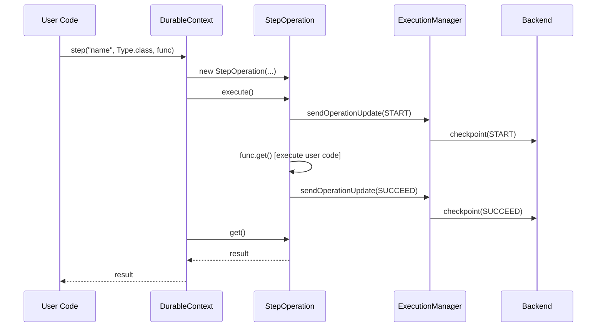
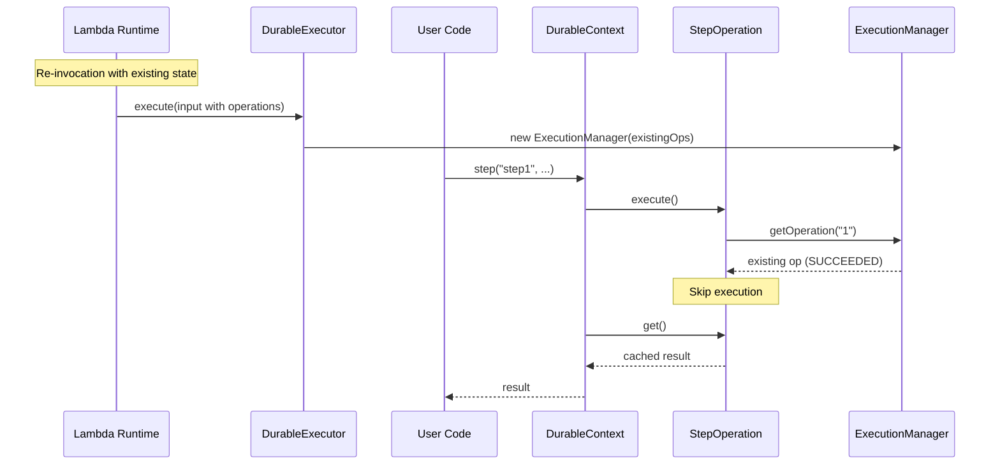
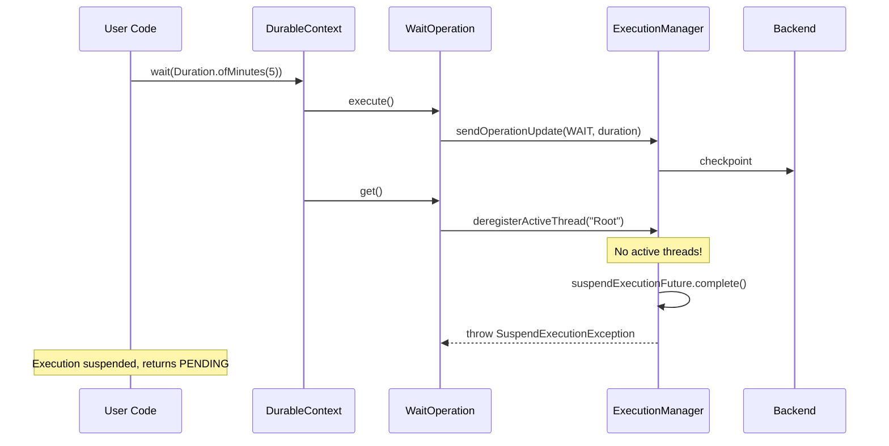

# AWS Lambda Durable Execution Java SDK - Internal Design

> **Note:** This document is for SDK developers and contributors. For user-facing documentation, see the [README](../README.md).

## Overview

This document explains the internal architecture, threading model, and extension points to help contributors understand how the SDK works under the hood. Core design decisions and advanced concepts are further outlined in the [Architecture Decision Records](adr/).

## Module Structure

```
aws-durable-execution-sdk-java/
├── sdk/                      # Core SDK - DurableHandler, DurableContext, operations
├── sdk-testing/              # Test utilities for local and cloud testing
├── sdk-integration-tests/    # Integration tests using LocalDurableTestRunner
└── examples/                 # Real-world usage patterns as customers would implement them
```

| Module | Purpose | Key Classes |
|--------|---------|-------------|
| `sdk` | Core runtime - extend `DurableHandler`, use `DurableContext` for durable operations | `DurableHandler`, `DurableContext`, `DurableExecutor`, `ExecutionManager` |
| `sdk-testing` | Test utilities: `LocalDurableTestRunner` (in-memory, simulates re-invocations and time-skipping) and `CloudDurableTestRunner` (executes against deployed Lambda) | `LocalDurableTestRunner`, `CloudDurableTestRunner`, `LocalMemoryExecutionClient`, `TestResult` |
| `sdk-integration-tests` | Dogfooding tests - validates the SDK using its own test utilities. Separate module keeps dependencies acyclic: `sdk` → `sdk-testing` → `sdk-integration-tests`. | Test classes only |
| `examples` | Real-world usage patterns as customers would implement them, with local and cloud tests | Example handlers, `CloudBasedIntegrationTest` |

---

## API Surface

### User-Facing (DurableContext)

```java
// Synchronous step
T step(String name, Class<T> type, Supplier<T> func)
T step(String name, Class<T> type, Supplier<T> func, StepConfig config)
T step(String name, TypeToken<T> type, Supplier<T> func)

// Asynchronous step
DurableFuture<T> stepAsync(String name, Class<T> type, Supplier<T> func)
DurableFuture<T> stepAsync(String name, Class<T> type, Supplier<T> func, StepConfig config)

// Wait
void wait(Duration duration)
void wait(String name, Duration duration)

// Lambda context access
Context getLambdaContext()
```

### DurableFuture

```java
T get()  // Blocks until complete, may suspend
```

### Configuration

```java
public class MyHandler extends DurableHandler<Input, Output> {
    @Override
    protected DurableConfig createConfiguration() {
        return DurableConfig.builder()
            .withLambdaClient(customLambdaClient)
            .withSerDes(new CustomSerDes())
            .withExecutorService(Executors.newFixedThreadPool(4))
            .build();
    }
}
```

| Option | Default |
|--------|---------|
| `lambdaClient` | Auto-created `LambdaClient` for current region, primed for performance (see [`DurableConfig.java`](../sdk/src/main/java/com/amazonaws/lambda/durable/DurableConfig.java)) |
| `serDes` | `JacksonSerDes` |
| `executor` | `Executors.newCachedThreadPool()` |

### Per-Step Configuration

```java
context.step("name", Type.class, supplier,
    StepConfig.builder()
        .serDes(stepSpecificSerDes)
        .retryStrategy(RetryStrategies.exponentialBackoff(3, Duration.ofSeconds(1)))
        .semantics(AT_MOST_ONCE_PER_RETRY)
        .build());
```

---

## Architecture

```
┌─────────────────────────────────────────────────────────────────────────┐
│                           Lambda Runtime                                 │
└─────────────────────────────────────────────────────────────────────────┘
                                    │
                                    ▼
┌─────────────────────────────────────────────────────────────────────────┐
│  DurableHandler<I,O>                                                     │
│  - Entry point (RequestStreamHandler)                                    │
│  - Extracts input type via reflection                                    │
│  - Delegates to DurableExecutor                                          │
└─────────────────────────────────────────────────────────────────────────┘
                                    │
                                    ▼
┌─────────────────────────────────────────────────────────────────────────┐
│  DurableExecutor                                                         │
│  - Creates ExecutionManager, DurableContext                              │
│  - Runs handler in executor                                              │
│  - Waits for completion OR suspension                                    │
│  - Returns SUCCESS/PENDING/FAILED                                        │
└─────────────────────────────────────────────────────────────────────────┘
                                    │
                    ┌───────────────┴───────────────┐
                    ▼                               ▼
┌──────────────────────────────┐    ┌──────────────────────────────┐
│  DurableContext              │    │  ExecutionManager            │
│  - User-facing API           │    │  - State (ops, token)        │
│  - step(), stepAsync()       │    │  - Thread coordination       │
│  - wait()                    │    │  - Phaser management         │
│  - Operation ID counter      │    │  - Checkpoint batching       │
└──────────────────────────────┘    │  - Polling                   │
            │                       └──────────────────────────────┘
            │                                       │
            ▼                                       ▼
┌──────────────────────────────┐    ┌──────────────────────────────┐
│  Operations                  │    │  CheckpointBatcher           │
│  - StepOperation<T>          │    │  - Queues requests           │
│  - WaitOperation             │    │  - Batches API calls (750KB) │
│  - execute() / get()         │    │  - Notifies via callback     │
└──────────────────────────────┘    └──────────────────────────────┘
                                                    │
                                                    ▼
                                    ┌──────────────────────────────┐
                                    │  DurableExecutionClient      │
                                    │  - checkpoint()              │
                                    │  - getExecutionState()       │
                                    └──────────────────────────────┘
```

### Package Structure

```
com.amazonaws.lambda.durable
├── DurableHandler<I,O>      # Entry point
├── DurableExecutor          # Lifecycle orchestration
├── DurableContext           # User API
├── DurableFuture<T>         # Async handle
├── StepConfig               # Step configuration
├── TypeToken<T>             # Generic type capture
│
├── execution/
│   ├── ExecutionManager     # Central coordinator
│   ├── CheckpointBatcher    # Batching (package-private)
│   ├── CheckpointCallback   # Callback interface
│   ├── SuspendExecutionException
│   ├── ThreadType           # CONTEXT, STEP
│   └── ExecutionPhase       # RUNNING(0), COMPLETING(1), DONE(2)
│
├── operation/
│   ├── DurableOperation<T>  # Interface
│   ├── StepOperation<T>     # Step logic
│   └── WaitOperation        # Wait logic
│
├── retry/
│   ├── RetryStrategy        # Interface
│   ├── RetryStrategies      # Presets
│   ├── RetryDecision        # shouldRetry + delay
│   └── JitterStrategy       # Jitter options
│
├── client/
│   ├── DurableExecutionClient        # Interface
│   └── LambdaDurableFunctionsClient  # AWS SDK impl
│
├── model/
│   ├── DurableExecutionInput   # Lambda input
│   ├── DurableExecutionOutput  # Lambda output
│   └── ExecutionStatus         # SUCCEEDED/PENDING/FAILED
│
├── serde/
│   ├── SerDes              # Interface
│   ├── JacksonSerDes       # Jackson impl
│   └── AwsSdkV2Module      # SDK type support
│
└── exception/
    ├── DurableExecutionException
    ├── NonDeterministicExecutionException
    ├── StepFailedException
    ├── StepInterruptedException
    └── SerDesException
```

---

## Sequence Diagrams

### Normal Step Execution



### Replay Scenario



### Wait with Suspension



---

## Extension Points

### SerDes Interface

Custom serialization for step results:

```java
public interface SerDes {
    String serialize(Object value);
    <T> T deserialize(String data, Class<T> type);
    <T> T deserialize(String data, TypeToken<T> typeToken);
}
```

Default: `JacksonSerDes` with Java Time support.

### RetryStrategy Interface

Custom retry logic:

```java
@FunctionalInterface
public interface RetryStrategy {
    RetryDecision makeRetryDecision(Throwable error, int attemptNumber);
}

record RetryDecision(boolean shouldRetry, Duration delay) {
    static RetryDecision retry(Duration delay);
    static RetryDecision doNotRetry();
}
```

Built-in strategies in `RetryStrategies`:
- `NO_RETRY` - Never retry
- `exponentialBackoff(maxAttempts, baseDelay)` - Exponential with jitter

### DurableExecutionClient Interface

Backend abstraction for testing or alternative implementations:

```java
public interface DurableExecutionClient {
    CheckpointDurableExecutionResponse checkpoint(
        String arn, String token, List<OperationUpdate> updates);
    
    GetDurableExecutionStateResponse getExecutionState(String arn, String marker);
}
```

Implementations:
- `LambdaDurableFunctionsClient` - Production (wraps AWS SDK)
- `LocalMemoryExecutionClient` - Testing (in-memory)

For production customization, use `DurableConfig.builder().withLambdaClient(lambdaClient)`.
For testing, use `DurableConfig.builder().withDurableExecutionClient(localMemoryClient)`.

---

## Exception Hierarchy

```
DurableExecutionException (base)
├── StepFailedException          # Step failed after all retries
├── StepInterruptedException     # Step interrupted (AT_MOST_ONCE)
├── NonDeterministicExecutionException  # Replay mismatch
└── SerDesException              # Serialization error

SuspendExecutionException        # Internal: triggers suspension (not user-facing)
```

| Exception | Trigger | Recovery |
|-----------|---------|----------|
| `StepFailedException` | Step throws after exhausting retries | Catch in handler or let fail |
| `StepInterruptedException` | AT_MOST_ONCE step interrupted mid-execution | Treat as failure |
| `NonDeterministicExecutionException` | Replay finds different operation than expected | Bug in handler (non-deterministic code) |
| `SerDesException` | Jackson fails to serialize/deserialize | Fix data model or custom SerDes |

---

## Backend Integration

### Large Response Handling

If result > 6MB Lambda limit:
1. Checkpoint result to backend
2. Return empty response
3. Backend stores and returns result

### Checkpoint Batching

Multiple concurrent operations may checkpoint simultaneously. `CheckpointBatcher` batches these into single API calls to reduce latency and stay within the 750KB request limit.

Currently uses micro-batching: batches only what accumulates during the polling thread scheduling overhead. Early tests suggest this window may be too short for effective batching—an artificial delay might need to be introduced.

```
StepOperation 1 ──┐
                  │
StepOperation 2 ──┼──► CheckpointBatcher ──► Backend
                  │
WaitOperation ────┘
```

Callback mechanism avoids cyclic dependency between `ExecutionManager` and `CheckpointBatcher`:

```java
interface CheckpointCallback {
    void onComplete(String newToken, List<Operation> operations);
}
```

### Retry Flow

```
STARTED ──► Exception ──► RetryStrategy.makeRetryDecision()
                                │
                ┌───────────────┴───────────────┐
                ▼                               ▼
        shouldRetry=true                shouldRetry=false
                │                               │
                ▼                               ▼
        Checkpoint RETRY                Checkpoint FAIL
        (status=PENDING)                (status=FAILED)
                │                               │
                ▼                               ▼
        Backend re-invokes              StepFailedException
        at nextAttemptTimestamp
```

---

## Testing Infrastructure

### LocalDurableTestRunner

In-memory test runner that simulates the full execution lifecycle without AWS.

```java
// Default: auto-skip time
runner.runUntilComplete(input);  // Instantly completes waits

// Manual control
runner.withSkipTime(false);
runner.run(input);               // Returns PENDING at wait
runner.advanceTime();            // Move past wait
runner.run(input);               // Continues from wait
```

### Failure Simulation

```java
// Simulate checkpoint loss (fire-and-forget START lost)
runner.simulateFireAndForgetCheckpointLoss("step-name");

// Reset step to STARTED (simulate crash after START checkpoint)
runner.resetCheckpointToStarted("step-name");
```

### CloudDurableTestRunner

Tests against deployed Lambda:

```java
var runner = CloudDurableTestRunner.create(arn, Input.class, Output.class)
    .withPollInterval(Duration.ofSeconds(2))
    .withTimeout(Duration.ofMinutes(5));

TestResult<Output> result = runner.run(input);
```

---

## Thread Coordination (Advanced)

The SDK uses a threaded execution model where the handler runs in a background thread, racing against a suspension future. This allows immediate suspension at `wait()` or retry points without waiting for handler completion. See [ADR-001: Threaded Handler Execution](adr/001-threaded-handler-execution.md) for the design rationale.

### Two-Phase Phaser Completion

**Problem:** Race between step completion and suspension check.

**Solution:** 
- Phase 0→1: Step done, waiters unblock
- Phase 1→2: Waiters reactivate, step deregisters

This ensures the main thread re-registers as active BEFORE the step thread deregisters, preventing premature suspension.

See [ADR-002: Phaser-Based Operation Coordination](adr/002-phaser-based-coordination.md) for the detailed rationale, alternatives considered, and sequence diagram.

### Suspension Detection

```java
// In ExecutionManager.deregisterActiveThread()
if (activeThreads.isEmpty()) {
    suspendExecutionFuture.complete(null);
    throw new SuspendExecutionException();
}
```
