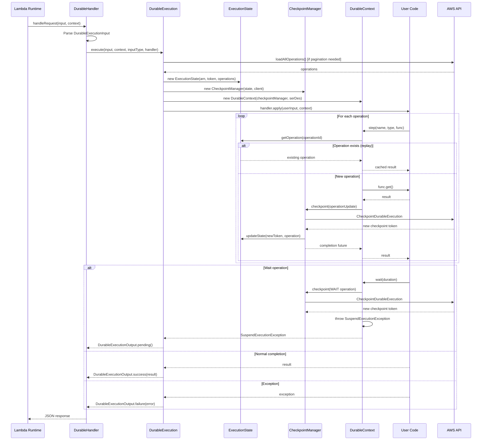
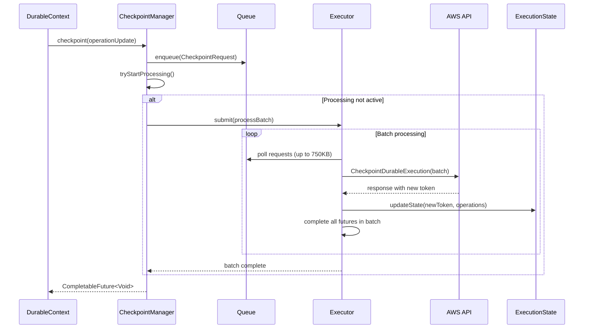
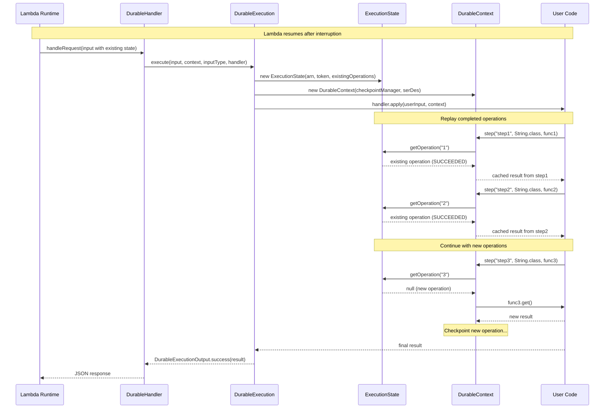
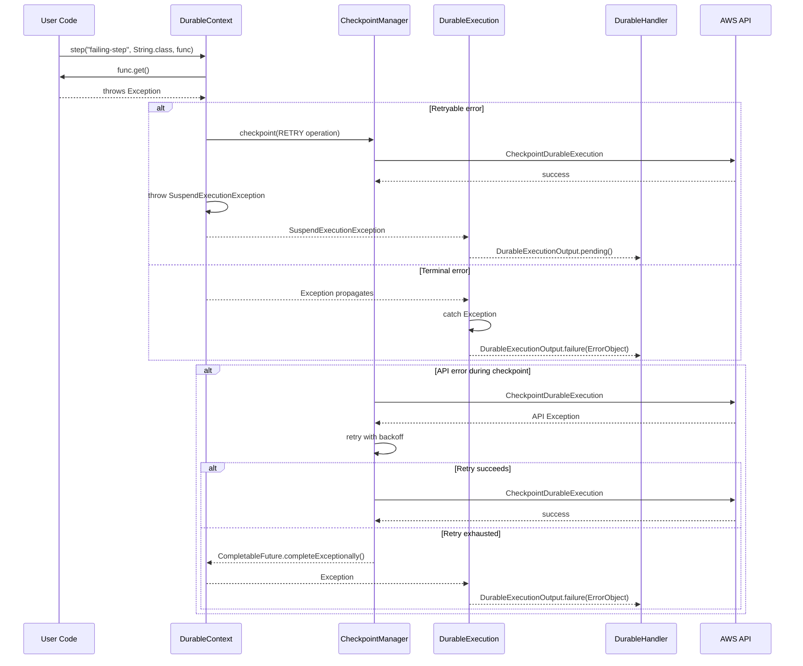

# AWS Lambda Durable Execution Java SDK - Sequence Diagram

## Normal Execution Flow

## Checkpoint Batching Detail

## Replay Scenario

## Error Handling Flow

## Key Interactions

### 1. **Initialization Phase**
- DurableExecution loads all operations (with pagination if needed)
- Creates ExecutionState with operation lookup map
- Initializes CheckpointManager with async executor

### 2. **Operation Execution**
- DurableContext checks ExecutionState for existing operations
- New operations execute user code and checkpoint results
- Replay operations return cached results without re-execution

### 3. **Checkpoint Batching**
- CheckpointManager queues requests and batches API calls
- Maintains 750KB size limit per batch
- Updates ExecutionState with new tokens atomically

### 4. **Suspension Handling**
- Wait operations checkpoint and throw SuspendExecutionException
- Exception propagates to DurableExecution
- Returns PENDING status to Lambda runtime

### 5. **Error Recovery**
- User code exceptions can trigger retries or terminal failure
- API errors are retried with exponential backoff
- Replay ensures progress is never lost
